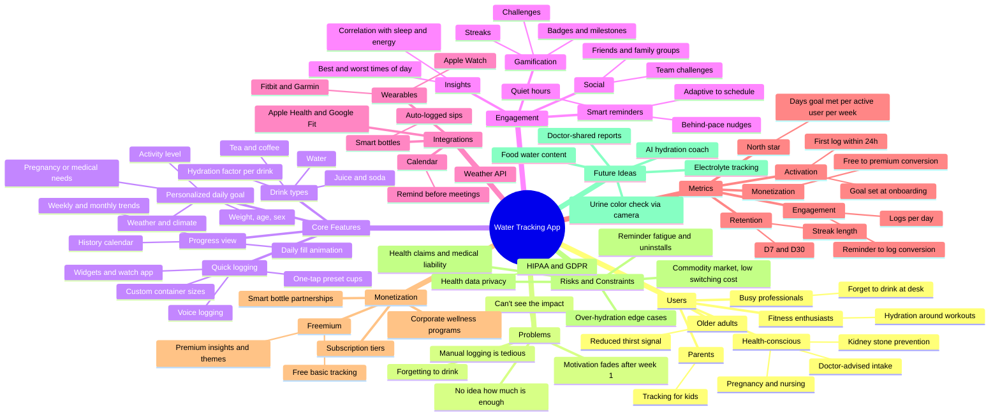

# Mindmap: Water Tracking App

A product-level map of a hydration tracking app: who it's for, what it does, how it keeps people coming back, and how success is measured.

```mermaid
mindmap
  root((Water Tracking App))
    Users
      Busy professionals
        Forget to drink at desk
      Fitness enthusiasts
        Hydration around workouts
      Health-conscious
        Pregnancy and nursing
        Kidney stone prevention
        Doctor-advised intake
      Older adults
        Reduced thirst signal
      Parents
        Tracking for kids
    Problems
      Forgetting to drink
      No idea how much is enough
      Manual logging is tedious
      Motivation fades after week 1
      Can't see the impact
    Core Features
      Personalized daily goal
        Weight, age, sex
        Activity level
        Weather and climate
        Pregnancy or medical needs
      Quick logging
        One-tap preset cups
        Custom container sizes
        Widgets and watch app
        Voice logging
      Drink types
        Water
        Tea and coffee
        Juice and soda
        Hydration factor per drink
      Progress view
        Daily fill animation
        Weekly and monthly trends
        History calendar
    Engagement
      Smart reminders
        Adaptive to schedule
        Quiet hours
        Behind-pace nudges
      Gamification
        Streaks
        Badges and milestones
        Challenges
      Social
        Friends and family groups
        Team challenges
      Insights
        Best and worst times of day
        Correlation with sleep and energy
    Integrations
      Apple Health and Google Fit
      Wearables
        Apple Watch
        Fitbit and Garmin
      Smart bottles
        Auto-logged sips
      Weather API
      Calendar
        Remind before meetings
    Metrics
      North star
        Days goal met per active user per week
      Activation
        First log within 24h
        Goal set at onboarding
      Engagement
        Logs per day
        Reminder to log conversion
      Retention
        D7 and D30
        Streak length
      Monetization
        Free to premium conversion
    Monetization
      Freemium
        Free basic tracking
        Premium insights and themes
      Subscription tiers
      Smart bottle partnerships
      Corporate wellness programs
    Risks and Constraints
      Reminder fatigue and uninstalls
      Health claims and medical liability
      Health data privacy
        HIPAA and GDPR
      Over-hydration edge cases
      Commodity market, low switching cost
    Future Ideas
      AI hydration coach
      Urine color check via camera
      Electrolyte tracking
      Doctor-shared reports
      Food water content
```
